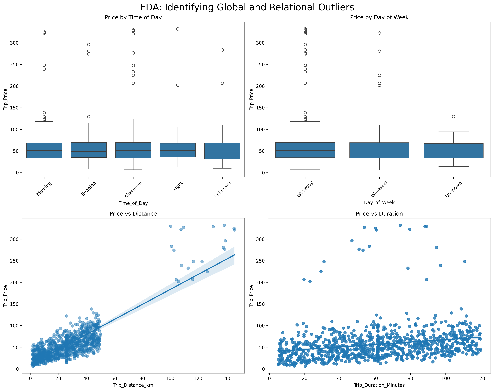
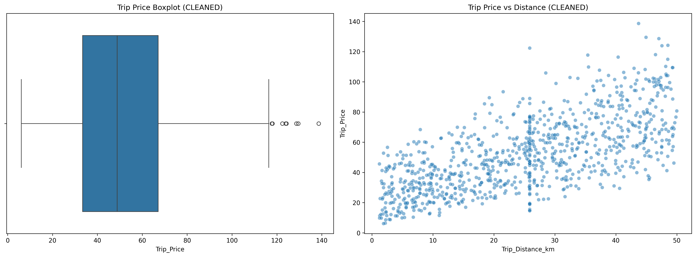
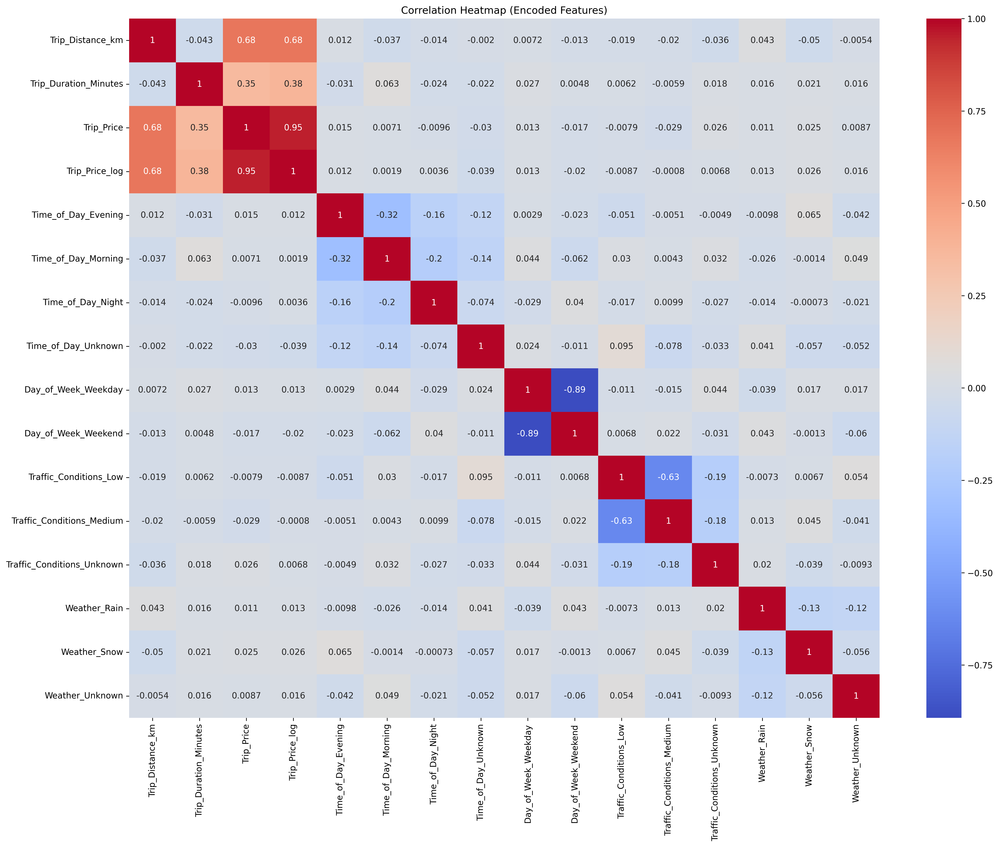
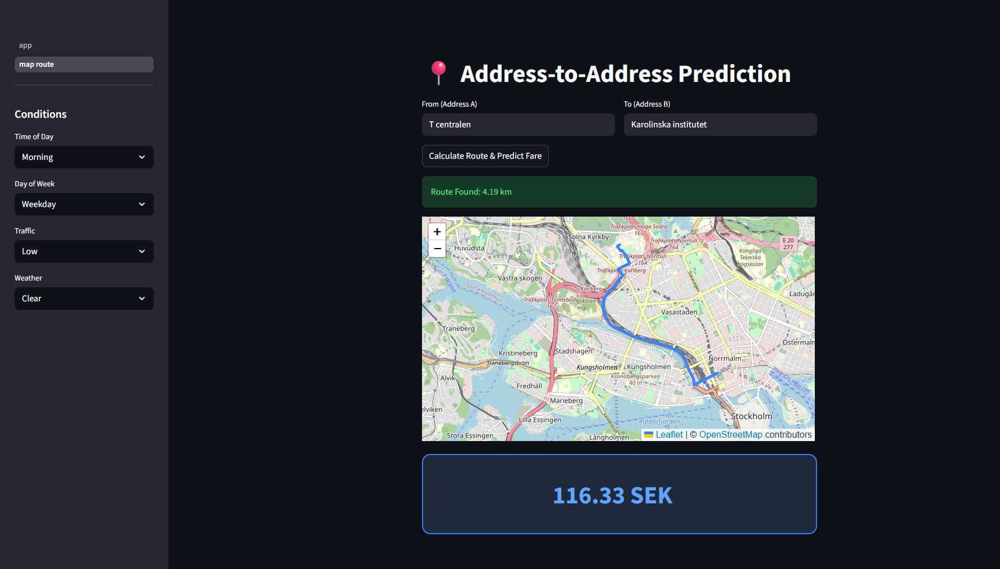

```text
taxi_prediction_fullstack_lilit/
├── .venv/
├── src/
│   └── taxipred/
│       ├── __init__.py
│       ├── backend/
│       │   ├── api.py
│       │   ├── data_processing.py
│       │   ├── ors_routes.py
│       │   └── model_rf.joblib
│       ├── data/
│       │   ├── screenshots/
│       │   │   ├── correlation_heatmap_encoded.png
│       │   │   ├── eda_cleaned_price_distance.png
│       │   │   ├── eda_outliers.png
│       │   │   ├── Streamlit_A_B_point.png
│       │   │   ├── streamlit_prediction.png
│       │   │   └── streamlit_ui.png
│       │   ├── df_predict.csv
│       │   ├── df_train.csv
│       │   └── taxi_trip_pricing.csv
│       ├── frontend/
│       │   ├── app.py
│       │   └── pages/
│       │       └── 1_Map_Route.py
│       ├── model_development/
│       │   ├── eda.ipynb
│       │   └── model_dev.ipynb
│       └── utils/
│           └── constants.py
├── .gitignore
├── .python-version
├── pyproject.toml
├── README.md
└── uv.lock
```

# 🚕 Taxi Trip Prediction System

A full-stack machine learning application for predicting taxi trip prices based on trip
distance, duration, traffic conditions, time of day, day of week, and weather.

---

## 📌 Project Overview

This project focuses on building a robust price prediction system using real-world–style
taxi trip data.  
The pipeline includes data cleaning, mathematical imputation, feature engineering,
outlier handling, model training, and deployment through a decoupled backend and frontend.

---

## 🗂 Project Structure

- **src/taxipred/backend** – FastAPI backend serving the trained model
- **src/taxipred/frontend** – Streamlit application for user interaction
- **src/taxipred/model_development** – Jupyter notebooks for EDA and model training
- **src/taxipred/data** – Raw and processed datasets + screenshots (EDA + Streamlit UI)

---

## 📊 Data Processing Pipeline

### 1. Data Cleaning

- Removed `Passenger_Count` due to negligible impact on price
- Identified missing values across numerical and categorical features
- Dropped a small number of rows with insufficient numerical information where reliable imputation was not possible
- Filled missing categorical values with `"Unknown"` to preserve data

---

### 2. Numerical Imputation (Leakage-Free)

Missing values in key numerical features were handled using **median imputation**
computed exclusively from the training dataset (`df_known`).

The following features were imputed:

- `Trip_Distance_km`
- `Trip_Duration_Minutes`

Using the median ensures robustness to outliers and prevents data leakage by
avoiding any reconstruction of values from the target variable or pricing formula.
The same median values derived from the training set were applied to the prediction set
to ensure consistency.

---

### 3. Feature Selection

After imputation, the following columns were removed:

- `Base_Fare`
- `Per_Km_Rate`
- `Per_Minute_Rate`

**Reasoning:**

- Prevents data leakage
- Avoids perfect multicollinearity
- Forces the model to learn real-world pricing patterns

**Final features used:**

- Trip_Distance_km
- Trip_Duration_Minutes
- Time_of_Day
- Day_of_Week
- Traffic_Conditions
- Weather

---

### 4. Outlier Handling

- Applied Interquartile Range (IQR) filtering
- Removed unrealistic high-distance and high-price trips
- Final training dataset size after cleaning and outlier removal: **916 rows**


---

### 5. Feature Encoding & Alignment

- One-hot encoded categorical variables
- Applied log transformation (`log1p`) to the target variable
- Ensured training and prediction datasets had identical feature structure

---

### 6. Statistical Validation & Integrity Check

Before finalizing the data for training, a rigorous statistical audit was performed using descriptive statistics (.describe().T):

- Outlier Mitigation: Verified that all entries in the final training set strictly adhere to defined thresholds.

- Normalization: Confirmed that the log-transformation successfully addressed skewness in the target variable.

- Feature Consistency: Verified that one-hot encoded variables are correctly scaled between 0.0 and 1.0.

- Schema Alignment: Ensured that df_predict.csv contains the exact same 14-feature statistical baseline as the training set.

---

#### Outlier Identification & Removal
This comparison shows how we eliminated noise by capping distances at 50km and prices at $150.

Below are key EDA plots used to justify cleaning and feature engineering.




#### Feature Relationships
The heatmap below validates our feature selection and highlights the strong correlation between distance and price.

---


## 🤖 Model Development & Evaluation

Model development followed a structured workflow: **baseline → linear model → tree-based model**.
Models were compared using **MAE, RMSE, and R²** on a held-out test set (and/or cross-validation).
The final model was trained on a **log-transformed target (`log1p(Trip_Price)`)** to reduce skewness
and improve numerical stability.

### Baseline Model

A simple baseline model was established using the median of the target variable.
This model serves as a reference point to ensure that any trained machine learning
model provides meaningful improvement over naive predictions.

### Linear Regression

Linear Regression was used as the first machine learning model due to its
simplicity and interpretability. The model was trained on the cleaned and
feature-engineered dataset and evaluated on a held-out test set.

Model performance was assessed using:

- Mean Absolute Error (MAE)
- Root Mean Squared Error (RMSE)
- R² score

The Linear Regression model significantly outperformed the baseline, achieving
a positive R² score and substantially lower error metrics, indicating that the
engineered features capture meaningful pricing patterns.

### Feature Scaling

Feature scaling was applied using `StandardScaler` for the Linear Regression model.
Linear Regression is sensitive to feature magnitude, and scaling ensures that all
numerical features contribute proportionally to the model.

For Random Forest, feature scaling was not applied, as tree-based models are
invariant to feature scale.


### Random Forest Regressor

Random Forest was evaluated to capture non-linear pricing effects and feature
interactions that linear models cannot represent. As a tree-based model, Random
Forest does not require feature scaling.

Compared to Linear Regression, Random Forest achieved lower error metrics and a
higher R² score, indicating improved predictive performance.

### Final Model Selection

Linear Regression was used as a reference model due to its simplicity and
interpretability. Random Forest achieved the best overall performance with
lower error metrics and a higher R² score.

Therefore, Random Forest was selected as the final model.

The selected Random Forest model was retrained on the full dataset before export.

### Model Export

After final model selection, the Random Forest model was retrained on the full
dataset to maximize learning from all available data.

The trained model was then exported using `joblib` to enable reuse during
deployment and inference:

- **Model file:** `random_forest_model.joblib`
- **Location:** `src/taxipred/backend/`

This file is later loaded by the backend service to serve price predictions
without retraining the model.

---

## 🌐 Application

## 🧰 Tech stack
- Python, FastAPI (backend API)
- Streamlit (frontend UI)
- scikit-learn + joblib (model + export)
- pandas + numpy (data processing)


## ▶ Run the full app (backend + frontend)

1) Start backend (FastAPI)
2) Start frontend (Streamlit)

The Streamlit UI will call the FastAPI API for predictions.

## ▶ Run the Backend (FastAPI)

From the project root:

```bash
uv run uvicorn taxipred.backend.api:app --reload
```
Open Swagger UI: 
http://127.0.0.1:8000/docs 

### API Endpoints
- `GET /api/taxi/v1/`  – API base entry point
- `GET /api/taxi/v1/health` – backend status
- `GET /api/taxi/v1/data/sample` – sample rows from training data
- `POST /api/taxi/v1/route` – route calculation (distance, duration, map geometry)
- `POST /api/taxi/v1/predict` – price prediction


## ▶ Run the Frontend (Streamlit)

Start the backend first (FastAPI), then in a new terminal run:

```bash
uv run streamlit run src/taxipred/frontend/app.py
```
Open the app in your browser:

- Streamlit UI: http://localhost:8501

**Note:** The Streamlit app calls the FastAPI endpoint:
`POST /api/taxi/v1/predict`

---

## 🧱 Architecture (High-level)

**Streamlit (Frontend)** collects user trip inputs and sends them to the backend.

**FastAPI (Backend)**:
- validates the input (Pydantic)
- transforms input into the exact model feature format (`data_processing.py`)
- loads the trained Random Forest model (`random_forest_model.joblib`)
- returns the predicted trip price

Flow:
**Streamlit → FastAPI `/api/taxi/v1/predict` → RandomForest model → Predicted price**

---

## 🖥️ Frontend (Streamlit)

### Streamlit UI


### Example prediction result


---

## 🗺 Bonus: Route-Based Price Prediction

As an additional feature, the application supports route-based taxi price prediction
using real geographic locations.

Users can enter a start address (A) and a destination address (B).
The backend integrates with **OpenRouteService (ORS)** to:

- Geocode human-readable addresses into latitude/longitude
- Calculate a realistic driving route
- Extract route distance (km) and estimated travel duration (minutes)
- Return route geometry for map visualization

The calculated distance and duration are automatically injected into the
machine learning prediction pipeline, removing the need for manual input and
reducing user error.

### Technical Design

- The **frontend (Streamlit)** never calls OpenRouteService directly
- A dedicated FastAPI endpoint (`POST /api/taxi/v1/route`) handles:
  - ORS communication
  - API key security
  - Error handling and timeouts
- This design keeps the system fully decoupled and production-oriented

The route is visualized using an interactive map, providing immediate
feedback to the user before price prediction.

### Currency Handling

The machine learning model predicts prices in the original training scale.
For presentation purposes, predicted prices are converted to **SEK** in the backend
using a fixed exchange rate.

This approach avoids introducing external currency APIs while keeping the
application realistic and deterministic for evaluation.

---

## 🖥️ User Interfaces
The application features a multi-page Streamlit interface to provide two distinct prediction modes:

1. Manual Fare Estimation (app.py)
* **Purpose**: Allows for "what-if" scenario testing.

* **Inputs**: Users manually adjust sliders for Distance (km) and Duration (min).

* **Factors**: Includes environmental variables like Time of Day, Traffic Conditions, and Weather.

2. Address-to-Address Prediction (1_Map_Route.py)
* **Purpose**: Real-world trip planning with automated distance calculation.

* **Inputs**: Users enter a Start Address (A) and an End Address (B).

* **Integration**: Connects to the OpenRouteService (ORS) API via the backend to fetch real-time distance and duration.

* **Visualization**: Displays an interactive Folium map showing the driving route.

* **Safety Mechanism**: Includes a **Geographic Boundary (Sweden-only)** and a **Distance Cap (100km)** to prevent unrealistic predictions outside the model's training range.

* **UI Screenshot**:


---
## 📦 Outputs
- `df_train.csv` – Cleaned and processed training dataset
- `df_predict.csv` – Aligned prediction dataset (32 trips)

---

## ⚠ Limitations
- Original pricing rate features were removed to prevent leakage
- Linear regression may not capture complex non-linear pricing behavior

---

## 🧠 Reflections / What I learned

- How to structure a full ML project with a clean separation between model development, backend API, and frontend UI.
- How to prevent data leakage (feature selection + consistent feature schema).
- How to serve a trained ML model with FastAPI and consume it from Streamlit.
- The importance of validating user input and transforming it into the exact feature format the model expects.
- How to integrate external services (routing APIs) into an ML system while keeping
  frontend and backend fully decoupled.

