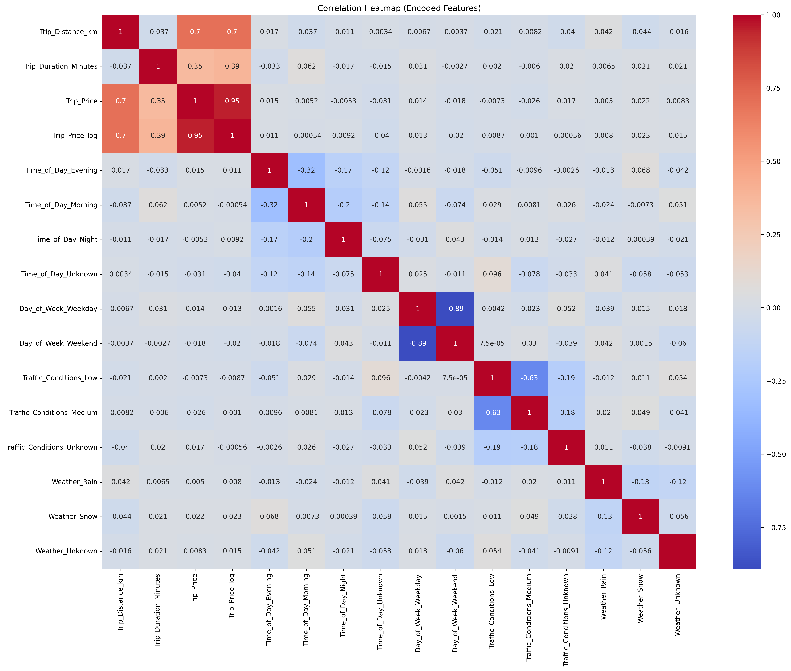

src/taxipred/
├── backend/                  # FastAPI backend and API layer
│   ├── api.py                # API endpoints for predictions and data access
│   └── data_processing.py    # Input validation and preprocessing logic
├── data/                     # Raw data, processed datasets, and EDA artifacts
├── frontend/                 # Streamlit frontend application
│   └── app.py                # User interface for price prediction
├── model_development/        # Jupyter notebooks for ML workflow
│   ├── eda.ipynb             # Exploratory Data Analysis and data cleaning
│   └── model_dev.ipynb       # Model training, evaluation, and selection
├── utils/                    # Shared utilities and constants
│   ├── constants.py          # Global constants and configuration values
│   └── __init__.py           # Marks utils as a Python package

# 🚕 Taxi Trip Prediction System

A full-stack machine learning application for predicting taxi trip prices based on trip
distance, duration, traffic conditions, time of day, day of week, and weather.

---

## 📌 Project Overview
This project focuses on building a robust price prediction system using real-world–style
taxi trip data.  
The pipeline includes data cleaning, mathematical imputation, feature engineering,
outlier handling, model training, and deployment through a decoupled backend and frontend.

---

## 🗂 Project Structure
- **src/taxipred/backend** – FastAPI backend serving the trained model
- **src/taxipred/frontend** – Streamlit application for user interaction
- **src/taxipred/model_development** – Jupyter notebooks for EDA and model training
- **src/taxipred/data** – Raw and processed datasets

---

## 📊 Data Processing Pipeline

### 1. Data Cleaning
- Removed `Passenger_Count` due to negligible impact on price
- Identified missing values across numerical and categorical features
- Dropped rows where multiple critical values were missing
- Filled missing categorical values with `"Unknown"` to preserve data

---

### 2. Mathematical Imputation
Missing numerical values were recovered using the pricing equation:

**Trip_Price = Base_Fare  
+ (Trip_Distance_km × Per_Km_Rate)  
+ (Trip_Duration_Minutes × Per_Minute_Rate)**

This approach minimized data loss while maintaining numerical accuracy.

---

### 3. Feature Selection
After imputation, the following columns were removed:
- `Base_Fare`
- `Per_Km_Rate`
- `Per_Minute_Rate`

**Reasoning:**
- Prevents data leakage
- Avoids perfect multicollinearity
- Forces the model to learn real-world pricing patterns

**Final features used:**
- Trip_Distance_km
- Trip_Duration_Minutes
- Time_of_Day
- Day_of_Week
- Traffic_Conditions
- Weather

---

### 4. Outlier Handling
- Applied Interquartile Range (IQR) filtering
- Removed unrealistic high-distance and high-price trips
- Final training dataset size: **916 rows**

---

### 5. Feature Encoding & Alignment
- One-hot encoded categorical variables
- Applied log transformation (`log1p`) to the target variable
- Ensured training and prediction datasets had identical feature structure

---

### 6. Statistical Validation & Integrity Check
Before finalizing the data for training, a rigorous statistical audit was performed using descriptive statistics (.describe().T):

- Outlier Mitigation: Verified that all entries in the final training set strictly adhere to defined thresholds.

- Normalization: Confirmed that the log-transformation successfully addressed skewness in the target variable.

- Feature Consistency: Verified that one-hot encoded variables are correctly scaled between 0.0 and 1.0.

- Schema Alignment: Ensured that df_predict.csv contains the exact same 14-feature statistical baseline as the training set.

---
## 🤖 Model Development

Multiple regression models are evaluated during the model development phase, including
linear and tree-based approaches. Model selection is based on cross-validation
performance, error metrics (MAE, RMSE), and interpretability.

The final selected model is trained using a log-transformed version of `Trip_Price`
to improve numerical stability and reduce skewness.

---

## 🌐 Application
- **Backend:** FastAPI serving predictions
- **Frontend:** Streamlit interface for user inputs and price prediction display

---

## 📦 Outputs
- `df_train.csv` – Cleaned and processed training dataset
- `df_predict.csv` – Aligned prediction dataset (32 trips)

---

## ⚠ Limitations
- Original pricing rate features were removed to prevent leakage
- Linear regression may not capture complex non-linear pricing behavior

---

## 📎 Notes
Detailed implementation steps, experiments, and visualizations
are documented in the `model_development` notebooks.

### 📊 Exploratory Data Analysis Visuals

To justify our cleaning and feature engineering decisions, we analyzed the relationships and distributions within the dataset:

#### Outlier Identification & Removal
This comparison shows how we eliminated noise by capping distances at 50km and prices at $150.

#### Feature Relationships
The heatmap below validates our feature selection and highlights the strong correlation between distance and price.

